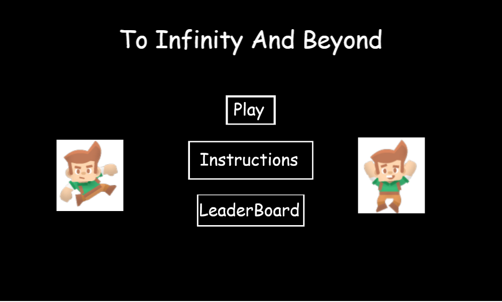
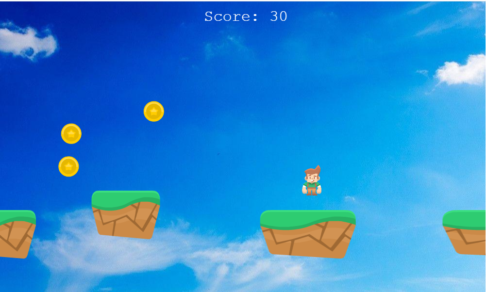
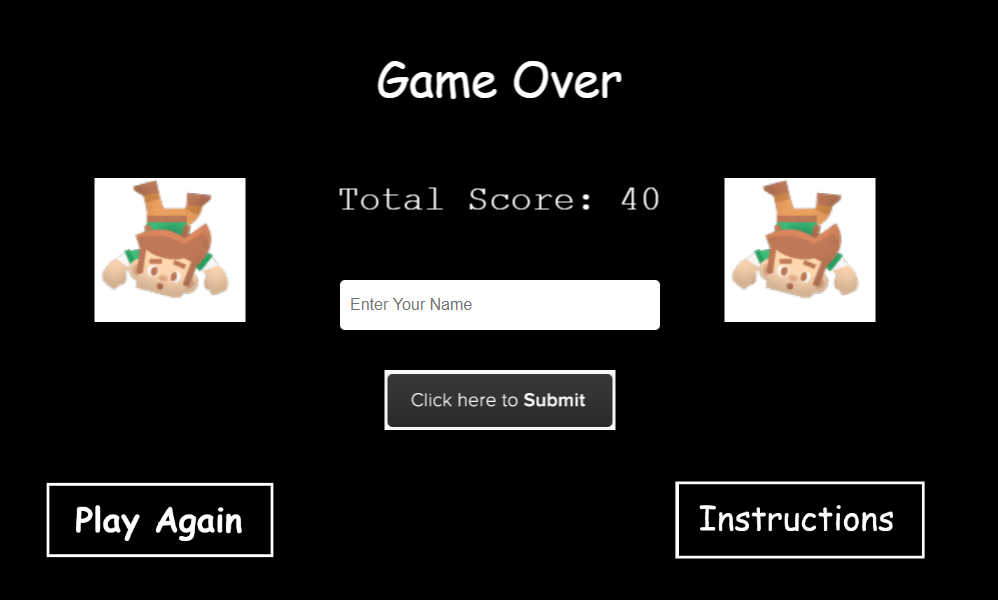

# Endless Runner Game

> This App is built using Phaser 3

To play this game, the player has to jump on the different platforms as they run towards the right of the screen. Ensure that you jump on the platform. A player collects points as he collects the coins falling from the upper section of the screen. Each star is 10 points, so ensure to collect as much as you can to be the best of the best.

## Built With

- Phaser
- Javascript
- Jest
- Webpack

## Live Demo

[Demo Link](https://elegant-ramanujan-b37b73.netlify.app/)

## Project Presentation

[Presentation Link](https://www.youtube.com/watch?v=pHOw4G5Ukoo&feature=youtu.be)

## Game instructions

- Use the up arrow key to jump over the infinite platforms.
- Use the left and right arrow keys to move and redirect your jump.
- Ensure there is contact with the stars so as to collect points.
- The only way to survive is to mantain yourself above the platforms.

### Project Setup

- Fork this GitHub repository
- Clone the repository to your machine
- Run 'npm install' to install the project dependencies
- Run 'npm start' to load the application on your browser
- Above command should open this URL http://localhost:8080/ on your browser.

## About Project
Development of a platform game as part of the Microverse curriculum to show technical and soft skills learned through the curriculum. Use of Phaser 3 to develop the game.

## Objectives

- Design the game, selecting a main theme for the game and characters.
- Research for assets and media content: sprite sheets and images.
- Write code for the game: Scenes, Characters.
- Add a score system
- Include a backend API to store a leader board.
- Add unit test using Jest.

## Achievements

- Choose an Avator as main character. Select a infinite platform game.
- Use spritesheet to show Avator's actions.
- Write code for different scenes: Load, Instructions, Menu, Game and GameOver Scene.
- Add coins as collectible items for the score system.
- Testing getScores, pushScores and displaying scores as transacted with API.

## Authors

👤 **Rajkumar Das**

- Github: [@rajkumardas2701](https://github.com/rajkumardas2701)
- Twitter: [@Rajkuma58621299](https://twitter.com/Rajkuma58621299)
- Linkedin: [Rajkumar Das](https://www.linkedin.com/in/rajkumar-das-41308961/)

## 🤝 Contributing

Contributions, issues and feature requests are welcome!

Feel free to check the [issues page](https://github.com/rajkumardas2701/runnerPhaser_JS/issues).

## Show your support

Give a ⭐️ if you like this project!

## 📝 License

This project is [MIT](lic.url) licensed.